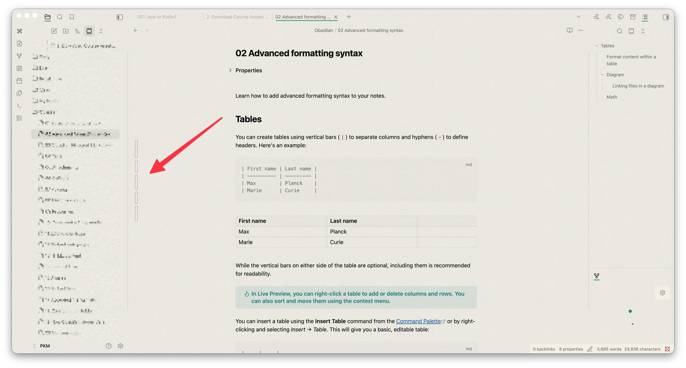

# Ink Floating TOC

Support Jayanta

  
  &nbsp;&nbsp;
  

**Ink Floating TOC** is a sleek, highly customizable, and unobtrusive Table of Contents plugin for Obsidian. Designed for users who want quick document navigation without sacrificing screen real estate or aesthetic appeal, it replaces bulky text lists with an elegant, interactive visual bar system.

Whether you are organizing a massive PKM vault on your desktop or reviewing notes on an iPad, Ink Floating TOC adapts perfectly to your workflow and your theme.

## Core Features

### Minimalist Visual Navigation

Instead of rendering a wall of text, headings (H1–H6) are represented by sleek, proportional bars. The length and thickness of each bar visually indicate the heading level, giving you an instant "bird's-eye view" of your document's structure at a glance.

### Multi-Device Interaction Engine

Built from the ground up to respect the hardware you are using. The plugin automatically detects whether you are using a mouse or a touch screen and adapts its controls:

**Desktop (Mouse):**

- **Click:** Instantly scroll to the heading.
    
- **Ctrl+Click (or Cmd+Click):** Fold or unfold the heading directly inside your text editor.
    
- **Alt+Click:** Collapse or expand sub-headings _within the TOC itself_ to declutter your view.
    

**Tablet (iPad/Touch):**

- **Single Tap:** Scroll to the heading.
    
- **Double Tap:** Fold/unfold the heading in the editor.
    
- **Triple Tap:** Collapse/expand sub-headings in the TOC.
    
- _Note: The plugin is intentionally disabled on phones to preserve narrow screen real estate._
    

### Advanced Customization

Make the TOC look exactly how you want it to, right from the settings menu:

- **Monochrome Mode:** A distraction-free default that automatically uses Obsidian's native muted text colors, seamlessly adapting whenever you switch between Light and Dark mode.
    
- **Custom Color Mapping:** Disable Monochrome to assign specific hex colors to H1 through H6 bars.
    
- **Bar Styles:** Choose between Solid Horizontal, Hollow Horizontal, Solid Vertical, or Hollow Vertical layouts.
    
- **Fluid Sizing:** Use built-in sliders to dial in the exact Bar Length Multiplier and Bar Thickness (in pixels).
    

### Smart Content Filtering

- **Hide Specific Headings:** Exclude specific heading levels from the TOC. Simply type `h3, h4 (or H3, H4, or just 3, 4)` in the settings, and the plugin will instantly filter those levels out of your visual outline.
    
- **Interactive Tooltips:** Hover over (or tap and hold) any bar to view a tooltip containing the exact text of that heading. Tooltips are automatically stripped of markdown syntax (like brackets or bold tags) for a clean reading experience.
    

##  Settings Overview

|**Setting**|**Description**|
|---|---|
|**Horizontal / Vertical Position**|Pin the TOC to any side or corner of your editor window.|
|**Hide Specific Headings**|Filter out clutter (e.g., enter `h3, h4 or H3, H4, or just 3, 4` to only see major sections).|
|**Bar Style**|Choose between solid fills or hollow borders, in horizontal or vertical orientations.|
|**Bar Length & Thickness**|Sliders to fine-tune the physical footprint of the TOC.|
|**Monochrome Bars**|Toggle native theme adaptation on or off.|
|**Heading Colors (H1-H6)**|(Only visible if Monochrome is off) Pick custom colors for every level.|

## If you like my work, consider support 👇️

